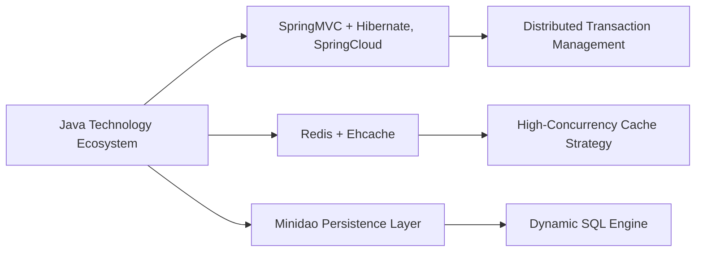

# JEEWMS Open-Source Warehouse Management Digital Platform Ecosystem

Designed for smart manufacturing and modern supply chain scenarios, JeeWMS is committed to building an open, collaborative, and scalable digital platform ecosystem for warehouse management. Built on an enterprise-grade Java technology stack, the platform integrates mobile terminals, industrial IoT, scheduling algorithms, and data analytics capabilities, providing enterprises with an integrated digital foundation from basic warehouse management to intelligent collaborative operations.

## ✨ Ecosystem Connections

* **Technical Community**

  * **QQ Technical Group ①**: 335607153 (Full)
  * **QQ Technical Group ②**: 313930553 (Technical Consulting / Implementation Services)

* **Open-Source Ecosystem Matrix**

  * Smart Manufacturing Platform JEEMES: Open-sourced [Gitee Link](https://gitee.com/erzhongxmu/jeemes)
  * Android Mobile App Open-Source Repository: [JeeWMSapp-uni](https://gitee.com/erzhongxmu/JeeWMSapp-uni)

* **Partners**
  

## 📈 Value Proposition

**Open-Source Warehouse Central Engine** | **GPL-3.0 License** | **Enterprise-Grade Technical Architecture**

With a cloud-based management platform and UNI-APP smart terminal as its core, JeeWMS builds fundamental warehouse digitalization capabilities covering **WMS / OMS / BMS / TMS**. It has been validated in cold chain logistics, FMCG, automotive manufacturing, and other industry scenarios. The platform provides enterprises with the following core capabilities:

* ✅ Multi-tenant architecture support
* ✅ Public cloud / private cloud / hybrid cloud deployment
* ✅ Industrial IoT integration, including PDA, RFID, AGV, and more
* ✅ Dynamic billing and business settlement engine
* ✅ Automated scheduling and task collaboration capabilities
* ✅ Business intelligence analytics and visual decision support

JeeWMS is not only an open-source warehouse management system, but also an important foundational platform for enterprises moving toward digital warehousing, intelligent operations, and ecosystem collaboration.

## 🤝 Ecosystem Cooperation Program

### Open-Source Co-Creation Program

JeeWMS follows the **GPL-3.0 open-source license**. Developers, implementation partners, and industry integrators are welcome to participate in ecosystem development:

* Continuous openness and transparent evolution of the technical roadmap
* Enterprise-grade issue response and collaboration mechanism
* Continuous integration and iterative version updates
* Co-development of scenario-based plugins, interface components, and industry capabilities

### Enterprise Services

Provided by [Huayi Intelligent](http://www.huayi-tec.com):

🔧 Industrial hardware integration solutions, including PDA / AGV / RFID
🔧 Private deployment and customized development
🔧 System performance optimization and architecture consulting
🔧 Industry solution design and implementation support

📧 Business Cooperation:
Phone: 13850081872
QQ: 290813851

## 🧩 Technical Landscape



## 🚀 Implementation Roadmap

1. **Environment Preparation**

   * JDK 1.8 + MySQL 5.7. For configuration optimization, please refer to the documentation.
   * Complete database parameter optimization according to the deployment documentation.
   * It is recommended to complete case-sensitivity settings and SQL mode adjustments in advance.

2. **Quick Deployment**

   ```bash
   mvn tomcat7:run
   idea springcloud
   ```

3. **Data Initialization**

   * MySQL Workbench is recommended for schema import and initialization.
   * Complete basic parameter and business dictionary configuration according to the project documentation.

## 📦 Industry Solutions

| Scenario                 | Technical Features                                           | Business Value                                                             |
| ------------------------ | ------------------------------------------------------------ | -------------------------------------------------------------------------- |
| Cold Chain Logistics     | Temperature-controlled traceability chain + batch management | Reduces losses and improves traceability and inventory turnover efficiency |
| Automotive Manufacturing | JIT material collaboration + AGV scheduling                  | Improves production-line delivery efficiency and material collaboration    |
| Third-Party Logistics    | Dynamic billing engine + multi-owner dashboard               | Improves financial processing efficiency and operational transparency      |

Note: Specific results may vary depending on enterprise scale, business processes, implementation depth, and management foundation.

## 📷 System Screenshots


## 📌 Join Us

Huayi Intelligent R&D Center continuously delivers smart warehouse solutions for Industry 4.0, promoting the deep integration of open-source technologies and industrial practices. We aim to help more enterprises move toward logistics digitalization and intelligence with lower barriers and higher efficiency.

[Learn More](http://www.huayi-tec.com)

